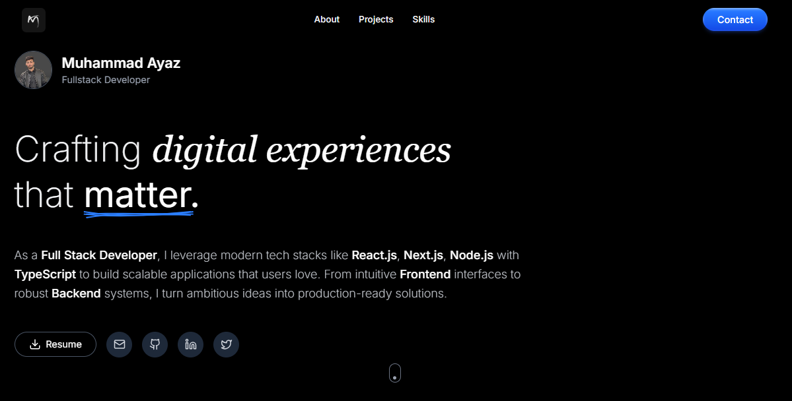

---

# 📌 Muhammad Ayaz – Portfolio



<!-- Replace with your real portfolio banner or screenshot image -->

---

## 👨‍💻 About Me

Hi, I’m **Muhammad Ayaz**, a passionate **MERN Stack Developer** dedicated to building scalable, responsive, and user-friendly web applications.

This repository contains the source code for my **personal portfolio website**, where I showcase my projects, skills, and journey as a developer. The portfolio reflects my expertise in:

* **Frontend:** React.js, Next.js, Tailwind CSS, Typescript
* **Backend:** Node.js, Express.js
* **Database:** MongoDB,PostgreSQL
* **Other:** Git, GitHub, Firebase, REST APIs, Postman,Prisma

---

## 🎯 Features

* 🖼️ Clean & modern design
* 📱 Fully responsive across devices
* ⚡ Built with Next.js + Tailwind CSS + Typescript
* 🎨 Easy to customize & extend

---

## 🚀 Live Demo

👉 [View Portfolio Website](http://muhammadayaz.vercel.app)

---

## 🛠️ Installation & Usage

To run this project locally:

```bash
# Clone the repository
git clone https://github.com/muhammadayaz77/MA-Portfolio.git  

# Navigate to the project folder
cd MA-Portfolio  

# Install dependencies
npm install  

# Run the development server
npm run dev  
```

The portfolio will be live at:
👉 `https://muhammadayaz.vercel.app`

---

## 🤝 Contributing

I’m always open to feedback and suggestions!

* Fork this repo
* Create a new branch (`feature-branch`)
* Commit your changes
* Open a pull request 🚀

---

## 📜 License

This project is licensed under the **MIT License** – you’re free to use, modify, and distribute.

© 2025 Muhammad Ayaz

---

✨ *Thanks for visiting my portfolio! Feel free to connect with me on [LinkedIn](https://linkedin.com/in/-muhammadayaz) or check out my other projects on [GitHub](https://github.com/muhammadayaz77).*

